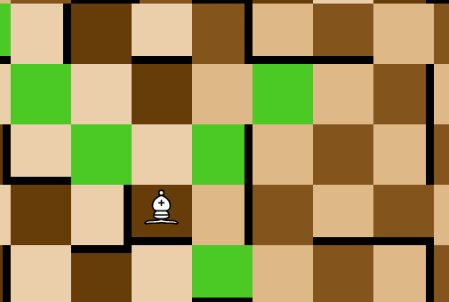

# Marauders-chess
Marauders' Chess is chess on steriods. The players are trapped in dungeons(main board), which consists of 6 square rooms(sub-board). Each square room is a 5x5 maze with some walls blocking the movement of pieces through them. Each room can rotate 90&deg; after certain number of moves.

Each player begins the game with 6 pieces: one king, one rook, two knights and two bishops. Objective is to kill the opponent's king in given time to escape the dungeon.
<br/>
<br/>
This game (event) was build for of Technothlon 2020 Mains (Final Round) which was held online due to COVID 19.

> Technothlon is an international school championship organized by the student fraternity of IIT Guwahati. Technothlon began in 2004 in a small room with an aim to "Inspire Young Minds" . Starting on our journey with a participation of 200 students confined to the city of Guwahati, over the past 15 years we have expanded our reach to over 400 cities all over India and various centers abroad. Now Technothlon spans its wings in 30+ countries internationally. Technothlon is not just an exam but it is an enthralling journey on the path of logic which will test your logical and creative thinking to its limit. The championship is organized over 2 rounds

Find more about technothlon [here](https://technothlon.techniche.org.in/)


# About this Repository

There are 2 branches `techno_final` and `Techno_server`.
### techno_final
This has the codebase of original event used in mains. It is build using MERN stack.
### Techno_server
After mains, participants and others requsted to host the game so they could play for fun. So we unlinked database (mongodb)(as it was used to store the outcomes of games in event, and we no longer needed it) and made some changes which includes slight UI improvement and some bug fixes.

# Some Snapshots

<br/>

<br/>
<div style="width:600px; margin: auto;">


</div>

## Run the application on local machine

First install dependencies

```console
$ npm install
```

In first terminal
```console
$ npm start 
```
In second terminal
```console
$ npm run serve 
```
